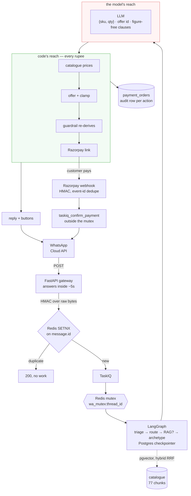
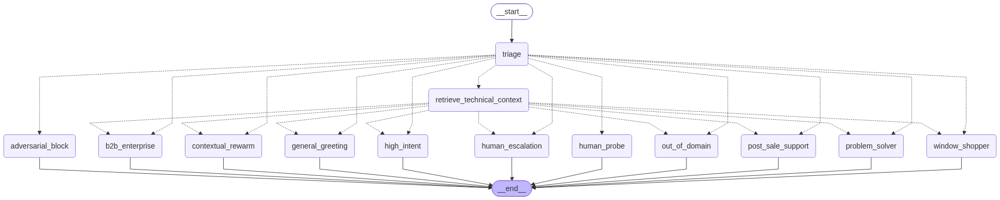

# Autonomous WhatsApp Commerce Agent

[](https://github.com/Shan091/sales_agent/actions/workflows/tests.yml)

**Razorpay AI Buildathon · Track 01 — AI Growth & Agentic Commerce**

A WhatsApp agent that runs an entire smart-home sale by itself: it discovers what you need, answers
technical questions from a real product catalogue, recommends and upsells, **builds a priced itemised
order, applies a bounded discount, mints a Razorpay Payment Link, and confirms the paid order in
chat** — with a full audit row behind every rupee.

Built on a live merchant: [Otohom](https://otohom.com) — smart-home and hospitality automation, with
regional offices across India, the UAE, KSA and Qatar. Razorpay runs in **test mode**; no real money
moves.

```
  Customer on WhatsApp                                       Otohom agent
  ───────────────────────                                    ────────────
  "I need switches for my 2BHK"          →   triage → RAG → archetype reply + tappable options
  "the 6-gang glass ones, 4 of them"     →   the dearer model, if it has  [ Switch to … ]
                                             one — the gains, then the
                                             difference as a small tag
                                         →   the product that pairs       [ Add … ]
                                         →   "Shall I show you the price?" [ Yes, show the price ]
  [ Yes, show the price ]                →   itemised order, code-built   [ Confirm & pay ]
  [ Confirm & pay ]                      →   "what name and city?"        (no link yet)
  "Anil, Kochi"                          →   guardrail re-check → Razorpay link
  pays with a test card                  →   webhook → "Order confirmed" + a receipt
```

The selling happens **before** the price, one message at a time — and asking for a figure outright
(*"how much?"*) skips straight to the order. That sequence is enforced in code, not asked for in a
prompt; see [the selling sequence is code](#the-selling-sequence-is-code-not-a-prompt). The step-up
beat exists only for the products that genuinely have a dearer model (exactly two do), so most sales
are **two** messages and two taps from the pick to a price — a beat with nothing verified to say is
skipped, not filled.

- **How it fits together:** [docs/architecture.md](docs/architecture.md)
- **Everything that broke on the way here:** [docs/engineering-log.md](docs/engineering-log.md)
- **Cold start, clone to paid order:** [docs/setup.md](docs/setup.md)

---

## The system, and where the trust boundary is



Two processes, one lock. The gateway verifies, dedupes and enqueues — no LLM or DB work, because Meta
retries after ~5 seconds. The worker does everything heavy under a per-customer Redis mutex, so one
customer's turns never run concurrently while two customers still run in parallel.

The red box is everything the model can influence. The green box is everything that decides what is
charged. There is no arrow from red to green that carries a number.

**The stack**, and why each piece is there rather than what it is:

| | | why this one |
|---|---|---|
| runtime | Python 3.12, Docker Compose | two images off one requirements file — an API and a worker that differ only in entrypoint |
| gateway | FastAPI | has to verify an HMAC and answer Meta inside ~5s; anything slower gets the webhook retried |
| orchestration | LangGraph + `langgraph-checkpoint-postgres` | conversation state survives a worker restart mid-sale, because a checkpointer is not a cache |
| queue / locking | TaskIQ + Redis | the mutex, the dedupe `SETNX` and the idempotency claims all need the same store the queue already uses |
| database | PostgreSQL + pgvector | the corpus, the checkpoints and the `payment_orders` audit rows are one transactional store, not three |
| retrieval | `BAAI/bge-m3` (1024d) + Postgres FTS, hybrid RRF | dense alone never matches a bare SKU; see log #7 |
| memory | mem0 + `all-MiniLM-L6-v2` (384d) | a one-line personal fact does not need a document-grade embedder — log #10 is why this is two models |
| models | Gemini 2.5 Flash / Flash-Lite via OpenRouter | two tiers: the sales turn gets Flash, triage and query rewriting get Flash-Lite at a fraction of the cost |
| tracing | Langfuse | per-turn spans and cost, which is how #3 and #14 were diagnosed rather than guessed |
| payments | Razorpay Payment Links + webhooks | a link needs no PCI surface, and the webhook closes the loop back into chat |
| channel | WhatsApp Cloud API | the customer is already there; interactive buttons are native |

---

## The one decision worth reviewing: the LLM never decides an amount

Everything else in this repo is ordinary engineering. This is the design claim.

```
LLM  decides  →  which SKUs, what quantity, and WHICH PREDEFINED OFFER id to apply
CODE decides  →  unit prices, offer eligibility, how much discount survives the clamp, the total
```

The model's output schema physically cannot carry money. `NodeExecutionSchema` exposes
`checkout_items: [{sku, qty}]`, `applied_offer: <one id from a closed registry>` and the *names* of one
step-up and one add-on to suggest — there is no amount field anywhere in it, and the prompt forbids
typing a figure in prose. The rupees are produced by a chain of code:

| Step | Where | What it guarantees |
|---|---|---|
| Resolve prices | `src/logic/pricing.py` | Unit prices come from the `products_pricing` table. Unknown or ambiguous names resolve to `None` and the SKU is **dropped, never guessed** (fail-closed normalised match, so "6sw" still finds "6 SW"). |
| Apply the offer | `src/logic/discounts.py` | Closed offer registry — an invented id (`MEGA90`) isn't in it, so it degrades to list price. Eligibility is checked against the *real* order. Discount clamped to `MAX_DISCOUNT_PCT`. **Installation labour is never discounted.** |
| Re-derive and refuse | `src/core/guardrails.py` | Independently recomputes the whole order and rejects on **any** mismatch: unit price vs catalogue to the paisa, discount ≤ ceiling and ≤ discountable value, qty ≤ cap, total inside `[min, max]`. |
| Render the quote | `discounts.format_quote_message` | The customer-facing itemised quote is **printed by code**, so the number on screen is provably the number code computed. |
| Re-price at mint | `processing.py::_process_checkout` | The catalogue is read **again** at mint time. The checkpointed amount is never trusted, however recently it was computed. |

**The worst case is bounded.** A fully jailbroken model that "agrees" to 90% off still gets
`MAX_DISCOUNT_PCT`, because that is the only number code will honour — and the attempt is recorded in
the order's `audit_notes`.

**The model only picks from sets it can see.** The injected policy block carries the offer registry and
the live priceable catalogue, and `checkout_items[].sku` must be copied from it character-for-character.
Neither block contains a percentage or a rupee figure — the agent is forbidden to state one, and the
surest way to hold that is never to show it one. Asking for "exact catalogue names" while showing none
is what produced invented SKUs like `GRANDE_6GANG_PANEL`, which fail closed to no quote at all.

**The upsell is bounded by the same idea.** A step-up may only be a pair from `discounts.UPGRADES`, a
closed hand-verified registry. The first version checked only that the swap *cost more*, which is not
sound: a 3-phase energy meter, an outdoor flood-light camera and an 8-gang switch panel are all dearer
than what a customer picked, and none is a step up from it — the first is decided by the building's
electrical supply, the second does a different job, the third is a fitment size. Across the 34 seeded
products exactly **two** pairs survived review (`Smart Door Lock Base → Premium`,
`Touch Screen Control Panel 7 inch → 10 inch`); the registry comment records every rejected candidate
and why. **Everything else gets no step-up at all** — the beat is skipped rather than filled with a
wrong part. Code computes the price difference and prints it per unit and per line, because "₹10,000
more" against four locks understates the ask by ₹30,000.

How the suggestion *reads* is deliberate too, and taken from the behavioural research behind the
project. Buyers distrust being upsold, so the card never announces one: it opens on **the strongest
thing the customer gains**, lists the rest as bullets, and carries the price difference as a small
italic tag inside the product line (`_(+₹10,000)_`) rather than as a second price. It closes on one
plain sentence — *"You'd get this one instead of the one you picked."* — which is both the honest
framing (a difference between two things, not the cost of an extra one) and a description of what the
code guarantees: the swap substitutes the line at the same quantity and asserts the line count is
unchanged. The `Keep the …` button is what makes declining free, so nothing in the card hedges, and the
model is forbidden to repeat any of it in prose, which would turn it back into a pitch.

The pairing card is built the same way and has to carry the sale on its own for most of the catalogue:
the benefit first, then a code-written *"Most people fitting a ‹product› want that too."* — a claim
about a common want, not a purchase statistic we don't hold — then the offer tier adding it unlocks. If
the model can't say what the customer gains, in words a customer would use, the suggestion is
**dropped** rather than shown as a bare price difference.

---

## The guards, named

"Bounded and gated" is only meaningful if you can point at the code. Seven guards, each fail-closed except
where noted, and each with the failure it exists to stop:

| guard | where | what it refuses |
|---|---|---|
| `Guardrails.validate_payment_request` | `src/core/guardrails.py` | the last check before a link is minted. Re-derives the whole order from its own line items — deliberately redundant with the code that computed it — and refuses on any mismatch, on a discount over `MAX_DISCOUNT_PCT` (12%), or on a unit price that disagrees to the paisa with `products_pricing` read fresh at mint time. That last one is what stops a tampered or stale checkpoint value being charged. Pure and sync, so the money rules are testable with no infrastructure |
| `validate_pricing_output` | same | scans the outgoing reply for currency amounts and suppresses the whole message unless **every** figure appears in that turn's verified set. Deliberately currency-anchored, so `800W` and `100-240V` are never read as prices |
| `sanitize_input` | same | nine injection patterns — ignore-previous-instructions, reveal-your-prompt, DAN, developer mode — substituted before the text reaches the graph. Defence in depth, not a complete control, and the code says so |
| `_sanitize_rag_chunk` | `src/graph/nodes/sales.py` | a *retrieved document* is untrusted too: tag-like sequences are neutralised in every chunk, so a poisoned or mis-edited chunk cannot forge a `</otohom_technical_context>` boundary or smuggle a fake `<system>` block into the prompt. A literal `< 5W standby` survives — the pattern requires a letter after the bracket |
| `GUARDRAIL_RULES` | `src/logic/prompts.py` | the client's hard NEVER list, composed into all seven sales prompts: no dates, no stock, no warranty approval, no competitor names, no invented specs, and an absolute prohibition on health or care-monitoring claims |
| `_care_claim_in` | `src/graph/nodes/sales.py` | the one guard that is **observability, not a guarantee** — a logged phrase check over the reply, because a model cannot be made incapable of inventing a capability. It is labelled that way in the code and in log #11 |
| `settings.assert_production_secrets()` | `config/settings.py` | refuses to boot with `APP_ENV=production` and a placeholder secret, since a default webhook secret means anyone can forge a "paid" event |

Above all of them sits the structural rule: the model chooses from **closed sets** — catalogue names, offer
ids, upgrade pairs — so an invention resolves to nothing rather than to something plausible. Three of the
logged problems ([#12](docs/engineering-log.md), [#15](docs/engineering-log.md),
[#20](docs/engineering-log.md)) are the record of learning that a prohibition in prose is not a guard.

---

## The selling sequence is code, not a prompt

The second design claim, and the one that came out of watching real transcripts: **when do you show the
price?** Two prompt revisions told the agent to sell before quoting. Both times it complied in words and
quoted anyway — the customer said "yes, the base one" and got a full itemised total with a pay button,
the step-up suggestion buried underneath where nobody reads.

So the sequence became a state machine (`state.py::consult_stage`, `sales.py::_next_beat`), monotonic
and code-owned:

| Beat | What the customer gets | Buttons |
|---|---|---|
| 1 · Step-up | The dearer model of what they just chose — the gains first, the difference as a small tag. **Only for the two verified pairs; skipped for everything else.** | `Switch to ‹Premium›` · `Keep the ‹Base›` · `Explore more` |
| 2 · Cross-sell | The product that pairs with it, why most people fitting theirs want it, and the offer tier adding it unlocks | `Add ‹product›` · `Just this for now` · `Explore more` |
| 3 · Ask | *"Shall I show you the price?"* plus one common problem someone in their situation is likely to have | `Yes, show the price` · a benefit label from the hook |
| 4 · Order | The itemised order, with a line saying they can change it by typing | `Apply N% off`-or-`Add ‹product›` · `Confirm & pay` · `Explore more` |

Four properties are worth calling out:

- **A beat with nothing verified to say is skipped**, not filled with something weaker. Most of the
  catalogue has no verified step-up, so the usual path is beat 2 → 3 → 4: **two taps from the pick to a
  price.**
- **`quote_requested` is a bypass.** An explicit *"how much is it?"* goes straight to beat 4, because a
  customer who asked for a figure must not be made to tap through anything first. That is the only
  distinction left to the model here, and it is one it can be checked on.
- **The beats cost zero LLM calls.** Six turns — the three walkthrough taps plus confirm, apply-offer
  and add-complement — are answered deterministically before the model is even built, from data
  validated when the order was priced. The walkthrough adds messages and *removes* model calls; a test
  monkeypatches `LLMFactory.get_llm` to raise and asserts a walkthrough tap still answers.
- **A beat belongs to the order it is walking.** The stage resets only when the new SKU set is
  *disjoint* from the old one — stricter than "differs" — so "add a curtain motor as well" grows the
  order and comes straight back re-priced, while a customer who returns next week and picks something
  else gets that product's own step-up beat instead of landing on a price.

---

## Every claim above, and the test that holds it

Nothing here asks to be taken on trust. Each row is one guarantee, the code that owns it, and the test
you can run to watch it fail if you break it.

| Guarantee | Where it lives | Test |
|---|---|---|
| The model's output schema has no amount field | `src/core/schemas.py::NodeExecutionSchema` | `test_autonomy.py::TestTheModelIsNeverShownAFigureItCouldRepeat` |
| A reason clause carrying a figure is dropped, button kept | `sales.py::_validate_upgrade` / `_validate_complement` | `test_payments.py::TestAStepUpIsOnlyEverAVerifiedPair` |
| An unresolvable SKU is dropped, never guessed | `src/logic/pricing.py::get_product_prices_batch` | `test_payments.py::TestPriceLineItems` |
| A discount is clamped however far the model "agreed" | `src/logic/discounts.py::apply_offer` | `test_payments.py::TestDiscountClamp` |
| The whole order is re-derived and refused on mismatch | `src/core/guardrails.py::validate_payment_request` | `test_payments.py::TestPaymentGuardrail` |
| A step-up is only ever one of two verified pairs | `src/logic/discounts.py::UPGRADES` | `test_payments.py::TestAStepUpIsOnlyEverAVerifiedPair` |
| The total appears only when the sequence says so | `sales.py::_next_beat`, `beat="hold"` | `test_payments.py::TestTheTotalGoesOnScreenOnlyWhenItIsAskedFor` |
| A walkthrough tap never builds a model | `sales.py::_execute_sales_node` | `TestTheConsultativeWalkthrough::test_a_walkthrough_tap_is_answered_without_ever_building_a_model` |
| Every gate fires for a tuple, a message and a dict | `src/graph/state.py::last_user_text` | `test_payments.py::TestGatesAcceptEveryInboundMessageShape` |
| A paid order can never be quoted or minted again | `processing.py`, `sales.py::_reproposes_paid_order` | `test_payments.py::TestASettledOrderIsNeverQuotedAgain` |
| Two Razorpay events for one payment send one receipt, last | `processing.py::_send_payment_confirmation` | `test_handoff.py::TestTheConfirmationSequenceHasOneOwner` |
| A forged or unsigned webhook is refused | `src/api/webhooks.py` | `test_payments.py::TestWebhookSignature` |
| Retired wording cannot come back into customer text | `discounts.py`, `sales.py` | `test_payments.py::TestRetiredWordingCannotComeBack` |
| Escalation survives full autonomy | `graph/nodes/triage.py` | `test_autonomy.py::TestCriticalSafetyValveSurvivesInBothModes` |

---

## Autonomy is narrowed escalation, not removed escalation

`AGENT_FULL_AUTONOMY=true` gates exactly two things: autonomous pricing and checkout. It does **not**
remove the human. `sales.py::_build_pricing_policy_block` resolves the `{pricing_policy_block}` every
selling prompt declares to one of two mutually exclusive policies — quote-and-take-payment, or the
merchant's original hand-to-a-human — and the critical safety valve stays wired in **both**: a persistent
request for a person, unresolved anger, a post-payment dispute, `MAX_PAYMENT_FAILURES` declines,
anything safety or legal. Flip the flag to `false` and the agent is the merchant's original lead-gen
assistant again, with the same tests green both ways.

Where a person takes over, they take over on their own number, so nothing they say passes through here.
The hold is released from WhatsApp — `#done <customer> <what you did>` — because the CLI needed a
terminal and a salesperson has a phone. The allowlist of staff numbers *is* the authorisation, and a
number that isn't on it gets an ordinary sales reply rather than an error, since anyone who learned the
syntax could otherwise release any hold on any thread.

---

## Honest numbers

Measured, not estimated. Where a number is unflattering it is here anyway, because the unflattering ones
are the ones that changed the design.

| | |
|---|---|
| Tests | **635**, of which **632 need no infrastructure at all** — no Postgres, no Redis, no API key, no model download |
| Live tests | **3** — the two retrieval gates, deselected rather than skipped so nobody mistakes them for having run |
| RAG, pipeline gate | **10/10** golden questions against the fixture corpus |
| RAG, live-catalogue gate | **12/12** catalogue-grounded questions against the corpus a customer actually reaches |
| RAG, the number that matters | those same ten sample questions score **2/10** against the live catalogue — which is why there are two gates and not one |
| Corpus | **77 chunks** (22 parents averaging 861 characters, 55 children) across six category folders, down from 107 after merging sections under 400 characters |
| Turn latency | **3.5–4.8s** steady state, from 15–42s before the model and timeout settings were fixed |
| First message of the day | was ~36s, of which ~24s was lazy model loading; now warmed at boot |
| Deterministic turns | a fast-path reply is handed to Meta **44–83ms** into the turn |
| Money bounds | discount ceiling **12%**, per-line qty cap **20**, order accepted only inside **₹1–₹500,000** |
| Catalogue | **34** seeded test-mode prices, **4** offer tiers, **2** verified step-up pairs |
| Complete sale | `PaymentOrder #7` · `pay_TXdKA3UXfCnS9X` · **₹30,300** — discovery to receipt in one WhatsApp thread, receipt delivered by the webhook, audit row behind it |

Eight turns cost **zero** LLM calls: the six checkout and walkthrough taps, plus the grounding refusal
when retrieval can't support what was asked, plus the name-and-city hold at the pay button. Adding the
selling beats made the sale *cheaper* in model calls, not dearer.

---

## What broke

Six of the thirty-eight that were **written down** — there were more, and the ones that taught nothing left no
record. Each of these was found by looking somewhere other than the happy path, and each is written up with the
evidence that caught it in **[docs/engineering-log.md](docs/engineering-log.md)** — ranked there by
consequence, the sixteen that matter most first.

**Checkout had never once worked, and the test suite was green.** Every gate on the money path opened
with `isinstance(last, HumanMessage)` while the worker seeded each turn as a `("user", text)` tuple. No
payment link could ever have been minted, and the "talk to a human" hatch was dead by the same line. The
tests passed because they built `HumanMessage` objects — the one shape production never produced. Fixed
in two layers on purpose (the reducer *and* one shape-tolerant helper every gate reads), because a money
gate must not depend on a reducer choice made in another file.

**A live payment link with zero audit rows behind it.** Timezone-naive datetimes into a `timestamptz`
column, inside a deliberately fail-soft audit write — so every insert was rejected silently and the money
moved with no record. Found by reconciling the link against the table, not by any error.

**"Better version" upsells validated only on price.** Every wrong pair passes a price test:
`Energy Meter Single Phase → 3 Phase` is decided by the building's incoming supply, so the check would
have sold a 3-phase meter into a single-phase home. Replaced with a closed hand-verified registry — two
pairs out of 34 products, and the rejected candidates documented with their reasons.

**RAG scored 10/10 on its own gate and 2/10 on the real catalogue.** Nothing failed closed on the misses,
so the model would have answered from whatever came back. Four of those questions asked for facts no
Otohom document contains — they became client questions rather than plausible numbers written into the
catalogue, because someone fits these to their front door.

**A voice note the customer never sent, fed into the graph as if they had.** `transcribe_audio` was a stub
that returned the string `"Simulated transcribed text (e.g. from Malayalam Voice Note)"`, and the worker put
that where the customer's words go. Nothing downstream can tell a placeholder transcript apart from something
a person actually typed — not triage, not retrieval, not the checkout gates — and this agent *transacts*, so
the failure mode is autonomous action on words nobody said. It now returns `None` and the worker asks for
text. Failing honestly beats succeeding falsely.

**A bug that could not be investigated, because success was invisible.** "The typing indicator sometimes
doesn't show" was the entire report, and it was all anyone could say: success logged at DEBUG and failure at
WARNING meant a silent turn was byte-for-byte indistinguishable from a working one in production logs. Once
the POST outcome logged at INFO with its own latency and how far into the turn it went out, the reported
failure turned out not to be happening — 200 on all nine turns — and the real defect was the opposite: on the
83ms fast paths the dots were drawn *after* the reply had already been sent. Without the instrumentation it
would have been "fixed" by making the indicator fire harder.

---

## Run it

The full guide, including Meta and Razorpay dashboard setup, is
**[docs/setup.md](docs/setup.md)**. The short version:

```bash
cp .env.example .env      # set OPENAI_API_KEY + the four Meta values; everything else has a default
docker compose up -d --build                                    # postgres+pgvector, redis, api :8000, worker
docker compose exec -T api python -m src.scripts.seed_pricing   # required — no prices, no quote

for c in switches security sensors curtains hubs; do \
  docker compose exec -T worker python -m src.scripts.ingest_catalog \
    --input-dir ./docs/catalog/$c --doc-type TECHNICAL_SPEC --category $c; done
docker compose exec -T worker python -m src.scripts.ingest_catalog \
  --input-dir ./docs/catalog/company --doc-type PRODUCT_CATALOG --category company
```

Then point a tunnel at `:8000` and set `PUBLIC_BASE_URL` — Meta and Razorpay both push to you.
`docker compose exec worker python -m src.scripts.local_chat` talks to the real graph, real retrieval
and real pricing from a terminal, with no Meta and no tunnel, which is the fastest loop for anything
except the payment webhook.

The tests need none of it:

```bash
pip install -r requirements-dev.txt      # requirements.txt + pytest
pytest --deselect tests/test_rag_pipeline.py::TestHybridSearch \
       --deselect tests/test_rag_pipeline.py::TestTheLiveCatalogueAnswersRealQuestions
# 632 passed, 3 deselected
```

---

## Repo map

| Path | What's in it |
|---|---|
| [src/api/](src/api/) | the gateway: HMAC verify, Redis dedupe, enqueue, the Razorpay webhook, the brochure |
| [src/tasks/processing.py](src/tasks/processing.py) | one turn: mutex, typing dots, graph run, then the money and lead blocks |
| [src/graph/](src/graph/) | `workflow.py` topology · `state.py` (state, `consult_stage`, `last_user_text`) · `nodes/` (triage, rag, sales) |
| [src/logic/](src/logic/) | `pricing.py` · `discounts.py` (offers, the upgrade registry, quote rendering) · `prompts.py` |
| [src/core/](src/core/) | `guardrails.py` · `schemas.py` (the trust boundary) · `llm_factory.py` · `text.py` |
| [src/rag/](src/rag/) | `embeddings.py` (parent-child chunking) · `ingestion.py` · `search.py` (asymmetric RRF) |
| [src/services/](src/services/) | `whatsapp.py` · `razorpay_service.py` · `crm_handoff.py` · `handoff_control.py` |
| [src/scripts/](src/scripts/) | `init_db` · `seed_pricing` · `ingest_catalog` · `local_chat` · `reset_thread` · `resolve_handoff` · `draw_graph` |
| [docs/catalog/](docs/catalog/) | the RAG corpus — hand-written markdown per category, cross-checked against the brochure |
| [tests/](tests/) | 635 tests; the money guarantees are in [tests/test_payments.py](tests/test_payments.py) |



---

## Limits, stated plainly

- **Razorpay runs in test mode.** Real keys and a real webhook secret are all that separates this from
  live, and `APP_ENV=production` hard-fails on a half-configured money path — but no real money has moved
  through it.
- **Meta business verification is still pending**, so the number is capped at 250 conversations a day and
  the agent can only message people who messaged first.
- **Prices are representative test-mode figures**, seeded by `seed_pricing` and labelled as such in the
  script. They are not official Otohom retail pricing.
- **Voice notes are refused, not transcribed.** `TranscoderService` returns `None` and the agent asks for
  text. It used to return a placeholder sentence, which is worse than failing: downstream, nothing can
  tell an invented transcript from something the customer actually said.
- **Four specs customers ask for exist in no Otohom document** — door-lock battery life in months, RFID,
  an anti-tamper alarm, and the 6 SW FAN's fan wattage. The agent answers that it doesn't have them,
  deterministically and with no model call, and they are open questions with the client.
- **Meta dismisses the typing indicator after ~25s** and offers no extend endpoint. Re-posting is
  best-effort; the real fix for a 25-second turn is a shorter turn.
- **The catalogue is hand-curated markdown, not the PDF.** The brochure auto-extracts to word-soup, so
  the corpus was written by hand per category and cross-checked against otohom.com. Editing it changes
  nothing until you re-ingest.

---

## Licence

MIT — see [LICENSE](LICENSE). The Otohom name, brochure artwork and product photography belong to
Otohom; neither the brochure nor the research material behind the selling design is in this repository.
