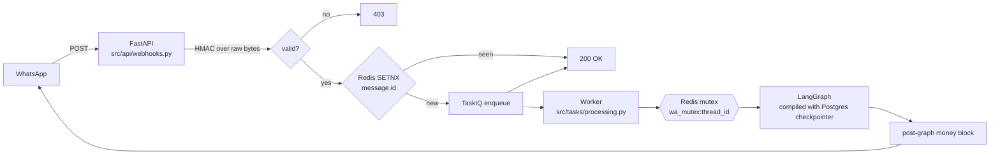
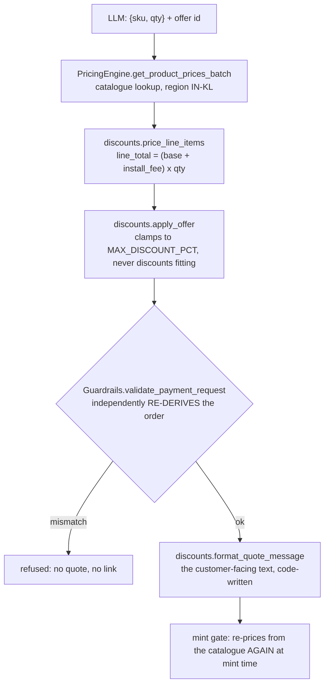
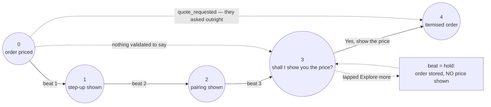
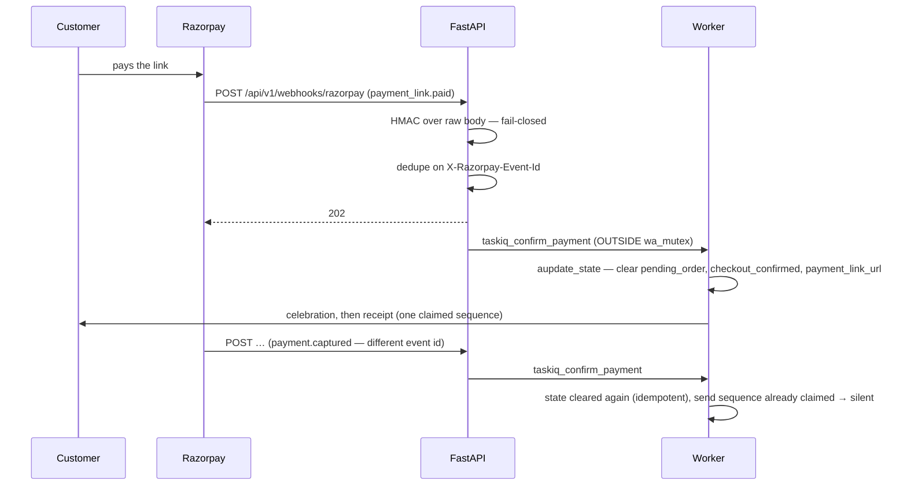

# Architecture

How an Otohom customer goes from *"hi"* on WhatsApp to a paid order, and where the boundaries
are drawn. The recurring theme: **the model decides what to say; code decides what is true.**
Every rupee, every sequence and every gate below is Python. The LLM has no path to any of them.

- **What broke on the way here:** [engineering-log.md](engineering-log.md)
- **Running it:** [setup.md](setup.md)

---

## 1 · Two processes, one lock

Meta gives a webhook ~5 seconds before it retries. An LLM turn takes longer than that, so ingress
and thinking are different processes.



The gateway does three things and returns: verify the signature over the **exact raw body**,
dedupe on Meta's `message.id` with `SETNX`, enqueue. Everything expensive — LLM, retrieval, DB
happens in the TaskIQ worker.

Both paths take a distributed Redis mutex `wa_mutex:{thread_id}` (`src/storage/cache.py`, released
by a Lua compare-and-swap so a process can only release its own lock), so one customer's turns
never run concurrently. The worker extends the TTL with a keepalive while it works. Two customers
run in parallel; one customer contradicting themselves twice in four seconds does not.

---

## 2 · The conversation graph

`src/graph/workflow.py` compiles: **`triage` → conditional route → (optional retrieval) → one
archetype node → END**, with a Postgres checkpointer persisting state per `thread_id`. One inbound
message is one graph run. The rendered topology is [graph.png](graph.png)
([source](graph.mmd)), regenerated from the compiled graph by `python -m src.scripts.draw_graph`.

Ten archetypes (`src/core/enums.py`) select the prompt; behaviour per archetype is entirely
prompt-driven (`src/logic/prompts.py`).

**The routing precedence in `route_after_triage` is order-sensitive and deliberate:**

| # | check                                                      | why it is where it is                                                                                      |
| - | ---------------------------------------------------------- | ---------------------------------------------------------------------------------------------------------- |
| 1 | `MALICIOUS_ADVERSARIAL`                                  | before the retrieval flag, so a prompt injection dressed as a spec question never reaches the RAG pipeline |
| 2 | `requires_human_handoff` **or** `handoff_active` | a colleague owns the thread until they release it; resuming here would put two voices on two numbers       |
| 3 | `data_routing_flag == "TECHNICAL_RAG"`                   | retrieve, then continue to the archetype node                                                              |
| 4 | archetype dispatch                                         | the ordinary path                                                                                          |

Nothing in that list is a preference. Reordering 1 and 3 is a security regression; reordering 2 is
a customer being answered by an agent and a human at once.

### State, and the reducer that turned out to be load-bearing

`state.py::ConversationState` is a `TypedDict`. Every key is last-value-wins except `messages`,
which uses LangGraph's **`add_messages`** reducer — it appends *and coerces*, so the worker's
`("user", text)` seed lands in state as a real `HumanMessage`.

That detail was not cosmetic. Under plain `operator.add` the tuple stayed a tuple, and every
deterministic gate that type-checked for `HumanMessage` returned `False` forever — no payment link
could ever have been minted (problem 6 in [engineering-log.md](engineering-log.md)).
The fix is deliberately two layers, because a money gate must not depend on a reducer choice made
in another file: the reducer coerces, **and** every gate reads `state.py::last_user_text`, which
accepts a `BaseMessage`, a `("user", text)` tuple or a `{"role", "content"}` dict.

Nodes return only the keys they change. Sticky fields survive a turn that doesn't restate them via
`response.x or state.get("x")`.

---

## 3 · The trust boundary: the model never emits an amount

This is the one design decision to understand before touching anything money-related.

`NodeExecutionSchema` (`src/core/schemas.py`) gives the LLM exactly this much reach over money:

| field                                                             | what the model may put in it                                                          |
| ----------------------------------------------------------------- | ------------------------------------------------------------------------------------- |
| `checkout_items[]`                                              | `{sku, qty}` — sku copied character-for-character from the injected live catalogue |
| `applied_offer`                                                 | **one id** from `discounts.OFFERS`, a closed registry                         |
| `suggested_upgrade` / `upgrade_replaces` / `upgrade_reason` | a pair from the closed`UPGRADES` registry, plus a figure-free clause                |
| `suggested_complement` / `complement_reason`                  | one catalogue name, plus a figure-free clause                                         |
| `quote_requested`                                               | did they literally ask what it costs                                                  |
| `explore_hook`                                                  | one figure-free, jargon-free sentence naming a problem they likely have               |

There is **no amount field, anywhere.** Code prices it:



Three properties hold this up:

- **The guardrail is independent, not a re-check.** `validate_payment_request` recomputes the order
  from the trusted catalogue and refuses on any mismatch, so a bug in the pricing path fails closed
  rather than charging a wrong figure.
- **Bounds are configuration, and code clamps to them.** `MAX_DISCOUNT_PCT` (12), `MAX_LINE_QTY`
  (20), `RAZORPAY_MIN_AMOUNT`/`RAZORPAY_MAX_AMOUNT` (₹1 – ₹500,000). Every clamp is recorded in
  `audit_notes`. The model can agree to more; it changes nothing.
- **The model only picks from sets it can see.** `{pricing_policy_block}` injects the offer registry
  *and* the live priceable catalogue (`PricingEngine.list_catalogue_names`). Neither block contains a
  percentage or a rupee figure — the agent is forbidden to state one, and the surest way to hold that
  is never to show it one. Asking for "exact catalogue names" while showing none is what produced
  invented skus like `GRANDE_6GANG_PANEL`, which fail closed to no quote at all.

### The guards, in the order input passes through them

The money guard above is one of seven. They are worth reading as a sequence, because each assumes the
one before it has already failed:

1. **`Guardrails.sanitize_input`** — nine injection patterns substituted out of the customer's text
   before it reaches the graph. Explicitly defence-in-depth: pattern matching cannot enumerate every
   phrasing, and the code says so where a maintainer will read it.
2. **`_sanitize_rag_chunk`** — the *retrieved document* is untrusted too. Tag-like sequences are
   neutralised in every chunk so a poisoned or mis-edited corpus file cannot forge a
   `</otohom_technical_context>` boundary or smuggle a `<system>` block into the prompt. A literal
   `< 5W standby` survives, because the pattern requires a letter after the bracket.
3. **Closed sets** — catalogue names, offer ids and upgrade pairs are injected as enumerable
   registries. This is the structural guard: an invention resolves to *nothing*, never to something
   plausible.
4. **`GUARDRAIL_RULES`** — the client's hard NEVER list, composed into all seven sales prompts from
   one constant. It is a prompt-level control and therefore the weakest kind, which is the argument
   for the two below.
5. **`Guardrails.validate_payment_request`** — the independent re-derivation described above.
6. **`Guardrails.validate_pricing_output`** — the outbound half. Every currency amount in the reply
   must appear in that turn's verified set or the whole message is suppressed and escalated. The
   regex is anchored on a currency marker, deliberately, so `800W` and `100-240V` are never read as
   prices.
7. **`settings.assert_production_secrets()`** — refuses to boot with `APP_ENV=production` and a
   placeholder secret. A default webhook secret means anyone can forge a `payment_link.paid` event,
   which makes this a money guard rather than a hygiene check.

**And one that is not a guarantee, labelled as such.** `_care_claim_in` is a logged phrase check over
the outgoing reply, looking for health, safety and care-monitoring language the catalogue cannot
support. It cannot be fail-closed the way a price can: there is no verified set of true capabilities
to compare against, only a list of phrasings that have been seen to go wrong. It is observability, the
code says it is observability, and the absolute prohibition in the prompt is what actually carries the
rule. The reason it stays absolute rather than nuanced is in the engineering log: somebody caring for
an elderly parent may act on the answer.

---

## 4 · The *order* of the sale is code too

A prompt rule owned this and failed twice: the agent quoted the instant a product was named, and
never upsold at all. So the sequence moved into a state machine — `state.py::consult_stage` (an int)
plus `sales.py::_next_beat` / `_beat_message` / `_advance`.

Once `checkout_items` resolves into a priced, validated `pending_order`, the customer is walked
through **one message at a time**:



`_STAGE_AFTER = {"hold": 0, "upsell": 1, "crosssell": 2, "quote_ask": 3, "quote": 4}`. `_advance` is
the **single** writer, it can only move forward, and it moves only alongside the message that earned
the move — so no beat is ever replayed, and a customer who comes back next week goes straight to a
price. Four rules make it behave:

- **A beat with nothing *validated* to say is skipped, not padded.** No verified step-up and no
  pairing product means 0 → 3 in one step: one message, not three. Beat 1 exists only for the two
  hand-verified `UPGRADES` pairs, so for most of the catalogue a skipped upsell beat is the *normal*
  case, not a fault.
- **`quote_requested` bypasses the whole thing.** Somebody who asked "how much?" must not be made to
  tap through anything first.
- **A beat belongs to the order it is walking.** `consult_order_key` holds the sorted, lower-cased,
  qty-excluded sku **set**, so 1 → 4 of the same thing refines the same sale. The stage resets only
  when the two sku sets are **disjoint** — stricter than "differs", so "add a curtain motor as well"
  grows the order and comes straight back re-priced instead of restarting the walkthrough.
- **`beat="hold"` is what makes the price button mean something.** The ask has two honest answers:
  the price tap, or saying so. A live chat found a third — the customer tapped the button documented
  as the way *out* of being priced and got an itemised total anyway. Now a `"quote"` beat that was
  not asked for outright, at stage 3, renders **no message at all** while still storing the validated
  order, and `_keep_price_reachable` puts the price button back in slot one of the model's own reply
  so typing is never the only route to the total.

The beats cost **zero** LLM calls. The sequence buys latency back rather than spending it.

---

## 5 · Seven gates, and the turns that never reach a model

`nodes/triage.py` holds seven deterministic gates, all reading `state.py::last_user_text`:

| gate                     | fires on                       | costs an LLM call?                                                     |
| ------------------------ | ------------------------------ | ---------------------------------------------------------------------- |
| `_is_connect_now`      | "Connect me now"               | no — routes to escalation                                             |
| `_is_confirm_checkout` | the**Confirm & pay** tap | no                                                                     |
| `_is_apply_offer`      | `APPLY_OFFER` postback       | no — re-prices, re-validates                                          |
| `_is_add_complement`   | `ADD_COMPLEMENT` postback    | no — appends, re-selects the offer, re-validates                      |
| `_is_swap_upgrade`     | `SWAP_UPGRADE` postback      | no — substitutes at the same qty, asserts the line count is unchanged |
| `_is_consult_next`     | `CONSULT_NEXT` postback      | no — re-renders the next beat                                         |
| `_is_quote_now`        | `QUOTE_NOW` postback         | no — re-renders the order                                             |

Six of the seven are answered in `_execute_sales_node` **before the LLM is even built**. Every one is
arithmetic, or a re-render of an order already in state; a model turn there is several seconds of
latency at the worst moment plus a chance to re-propose the order mid-checkout. All six clear
`checkout_confirmed`, because a new total — or a re-shown one — needs a new authorisation.

Two more paths answer with no model call: the **grounding refusal** (§7) and the **name hold** below.

**Why postback ids and not phrases.** The four walkthrough gates match an id (`ADD_COMPLEMENT`,
`SWAP_UPGRADE`, `CONSULT_NEXT`, `QUOTE_NOW`) because their button labels are built per-order — there
is no fixed phrase to match. `processing.py` appends `[<postback_id>]` to the tapped title, which is
what makes them matchable at all. Labels are therefore free to change; gates never break on wording.

### The name is mandatory at the pay button

The merchant's rule: no link is minted for an order with nobody's name on it. So the confirm tap's
fast path checks `customer_name` first — missing, it asks *"what name and city should I put on the
order?"*, sets `awaiting_pay_details` and mints nothing. The mint gate reads that flag too, so a held
tap cannot slip through. The next message is parsed **in code** (`sales.py::_parse_name_and_city`) and
the link mints on the *same* authorisation.

The parser **refuses rather than guesses**: a button tap, a question, anything over 60 characters or
with no letters falls through to an ordinary turn with the ask still outstanding. Storing *"why do you
need my name?"* as a name would put it on the order, the sheet and the receipt.

This replaced a post-receipt details ask, which lived after the money, was routinely ignored, and
left the team with orders nobody's name was on.

---

## 6 · The money action lives outside the graph

Minting a payment link is not a conversational turn, and it must not be replayable. So it is a
post-`astream` block in `processing.py`, not a node:

```
gate:  checkout_confirmed  AND  pending_order  AND  NOT payment_link_sent  AND  NOT awaiting_pay_details
```

- A LangGraph checkpoint replay or a TaskIQ retry re-runs the graph, not the block's effect —
  `payment_link_sent` is set True **only on a successful mint**, so a transient failure leaves the
  button re-tappable while a success cannot double-charge.
- `_process_checkout` **re-prices from the catalogue at mint time.** The checkpointed amount is never
  trusted, however recently it was computed.
- On the confirm turn the sales node deliberately does **not** rebuild `pending_order` — that would
  reset the dedup flags and cancel the mint.
- Every mint writes a `PaymentOrder` audit row. `created_at`/`updated_at` are `timestamptz`, because
  they weren't once and asyncpg rejected every insert inside a deliberately fail-soft write — a real
  link with **zero** audit rows behind it.

### Closing the loop



Two properties earned their code:

- **A paid order must stop being a pending one.** The mint gate reads `pending_order`, and any later
  turn that rebuilds a quote resets `payment_link_sent` — so a paid order left in state sat one tap
  from a second live link for something already bought. It happened. The paid branch clears it, and
  `sales.py::_reproposes_paid_order` is a second layer that suppresses a rebuilt quote matching
  `paid_line_items` on **sku and quantity**, so a genuine second order still gets quoted.
- **The post-payment messages are one sequence with one owner.** Razorpay sends two events for the
  same money with different event ids, so the webhook's dedup cannot collapse them. Per-message
  idempotency was the wrong grain: the two runs interleaved and a question overtook the receipt.
  `_send_payment_confirmation` claims the whole sequence on `paid-notify:{payment_id}`. The claim sits
  **below** the state clear on purpose — losing a race must never be what leaves a paid order mintable.

**The decline ladder is 1-2-3, not 1-2.** First decline: resend the live link, no human button — a
card quirk needs no person, and offering one implies something is broken mid-sale. Second: resend plus
the hatch. Third (`MAX_PAYMENT_FAILURES`): escalate.

---

## 7 · Retrieval

Two flows that share nothing but a table.

**Offline ingest** — `scripts/cleaner.py` (strips marketing boilerplate, never touches headers,
tables or list items) → `rag/embeddings.py` (parent-child chunking) → `rag/ingestion.py` (idempotent
upsert keyed by `source_hash`, children embedded in batches). The corpus is hand-curated markdown
under [catalog/](catalog/), by category. The merchant's brochure PDF auto-extracts to word soup, so
it was written out by hand and cross-checked against brochure.

**Online retrieve** — `graph/nodes/rag.py` condenses the conversation into a three-variant
`QueryExpansion`, batch-embeds it, then calls `rag/search.py::hybrid_search`.

### Asymmetric RRF, and what its numbers mean

Dense (pgvector cosine) and lexical (`tsvector`) results are fused with reciprocal rank at **k=60
dense / k=30 lexical**, so an exact SKU hit outranks a merely similar chunk. Ranks are 0-based, so
with three query variants the top score **ceilings at 0.15** (`3 × 1/60 + 3 × 1/30`). That is a
rank-fusion figure, not a similarity, and it is deliberately *not* what the gate reads.

**It is fail-closed:** below `RAG_SIMILARITY_THRESHOLD` (0.50, calibrated against `bge-m3` and this
corpus — in-domain answers score 0.56–0.69, off-domain junk 0.36–0.45) *and* with fewer than
`MIN_LEXICAL_TERMS_FOR_RESCUE` (2) distinct query concepts matched lexically, it returns `[]`, which
triggers the deterministic `PricingEngine` fallback before any human escalation.

### One SKU, two spellings, and only one of them matched

The catalogue writes `## 4 SW`. The customer — and the condenser rewriting them — writes `4SW`. The
`simple` dictionary neither stems nor splits on case, so `4 SW` indexes as the lexemes `(4, sw)` while
`4sw` is one lexeme: against the chunk holding the answer, `to_tsquery('simple','4sw')` was **false**
and `to_tsquery('simple','4<->sw')` was **true**. The exact-SKU boost the whole k=30 asymmetry exists
to deliver had never fired for the spelling the model most often produces.

`_lexical_term_groups` now emits both spellings in both directions and drops the bare parts (`sw`
alone matches every switch section in the file). It returns **groups, one per concept** — not a flat
list — because `matched_terms` feeds a safety threshold, so two spellings of one product must count
once. `_group_tsquery` parenthesises each group so mixing `|` with `<->` never rests on operator
precedence, and nothing but alphanumerics reaches `to_tsquery`.

### Parents big enough to answer with

Twelve product sections in the switches document are 53–105 characters (`## 4 SW` plus one bullet).
One parent each broke retrieval twice: cosine cannot separate a dozen near-identical tiny chunks, and
a 65-character parent carries no context even when it *is* right, because every shared spec lives in
the document intro. Consecutive sections under `RAG_MIN_PARENT_CHARS` (400) now share one parent —
never across an H1, never past the parent budget.

The half that matters: **children still come from each original section**, or the child splitter would
re-cut a 1,580-character parent on size alone and one embedding would cover four products. Each
section's text stays a verbatim substring of the merged parent; there is a test for exactly that.
Live corpus after re-ingest: **107 chunks → 77** (22 parents averaging 861 characters), and "which
lock has the bigger battery?" became answerable from a single parent.

### Two gates, because a green pipeline says nothing about the corpus

| gate                                         | what it asks                                                                                                                          | measured        |
| -------------------------------------------- | ------------------------------------------------------------------------------------------------------------------------------------- | --------------- |
| `TestHybridSearch`                         | *does the pipeline work?* — Golden Questions over the fixture's own sample corpus                                                  | **10/10** |
| `TestTheLiveCatalogueAnswersRealQuestions` | *can a customer get an answer?* — 12 questions against the **ingested** corpus, no fixture, nothing written, nothing deleted | **12/12** |

Both exist because the same ten sample questions score **2/10** against the live catalogue. The
pipeline gate had never been run against live infrastructure; running it passed, and it would have
kept passing over a corpus that answered almost nothing.

### Retrieval returning rows is not retrieval finding the thing

RRF always hands back its top-k, so a question about a product that doesn't exist still gets three
chunks about neighbouring products — measured: a fictional "SmartVault X9" retrieved switch and lock
chunks. Nothing fails closed there, and the model would answer from whatever came back.

So when condensation names a product and no retrieved chunk mentions it (`rag.py::_mentions`,
alphanumeric-normalised so `6SW` = `6 SW`), the node sets `specs_unavailable` and `_execute_sales_node`
answers deterministically with **no LLM call**. A prohibition sitting 93% of the way through a 24k
system prompt did not hold in testing; this does. Ordering matters: all six checkout fast paths are
checked *before* it, so a grounding refusal can never swallow the pay turn or strand a customer
mid-walkthrough.

**`specs_unavailable` catches an invented product, not an invented capability.** That gap is real and
documented — see [engineering-log.md](engineering-log.md). The defence there is an absolute prompt
prohibition plus a logged phrase check that is **observability, not a guarantee**.

---

## 8 · Three memories, doing three different jobs

| memory                 | mechanism                                           | lifetime              | holds                                                                                                                                                                                                            |
| ---------------------- | --------------------------------------------------- | --------------------- | ---------------------------------------------------------------------------------------------------------------------------------------------------------------------------------------------------------------- |
| **Conversation** | LangGraph Postgres checkpointer, keyed`thread_id` | forever, per customer | archetype,`consult_stage`, `pending_order`, dedup flags — durability is load-bearing: a priced order lives here between the pay tap and the mint                                                            |
| **Semantic**     | mem0 + pgvector, own small embedder                 | forever               | short personal facts ("lives in Kochi", "has a 3BHK"). Off by default; extraction runs in`taskiq_store_memory`, **outside** the turn, because inside `wa_mutex` it delayed the customer's next message |
| **Knowledge**    | pgvector`document_chunks`, parent-child           | until re-ingest       | the product catalogue — shared, not per-customer                                                                                                                                                                |

mem0 gets a deliberately different embedder from RAG (`all-MiniLM-L6-v2`, 384 dims): matching
one-line personal facts is not the same job as matching documents, and sharing `bge-m3` loaded a
second ~2.2GB copy into the worker for it.

---

## 9 · The human is a valve, not a fallback

`AGENT_FULL_AUTONOMY` (default True) narrows escalation; it does not remove it.
`sales.py::_build_pricing_policy_block` resolves the `{pricing_policy_block}` every selling prompt
declares to exactly one of two mutually exclusive policies — `PRICING_AUTONOMY` (quote, negotiate
within policy, discount from the closed registry, take payment) or `PRICING_LEGACY` (the merchant's
original no-quoting policy that bridges to a person).

Money rules are deliberately **not** in `GUARDRAIL_RULES`: a prohibition there plus a permission
later in the same system prompt makes the model erratic at exactly the wrong moment.

**The critical valve stays wired in both modes:** persistent human request, unresolved anger,
post-payment disputes, repeated payment failures, safety or legal asks. `tests/test_autonomy.py`
asserts both directions.

### Handoff is human-driven, and sticky

`node_human_escalation` sets `handoff_active`, and `route_after_triage` checks it *alongside* the
per-turn flag — so a customer messaging during a hold gets a short holding line, not a fresh sales
turn. The colleague works the customer on a **different** WhatsApp number, so nothing they say is
visible to this system: the release **note** is the only channel back, injected as `{handoff_block}`
on later turns and onto the sheet row.

A colleague releases the hold from WhatsApp, because that is the channel that actually gets used — a
CLI script needs a terminal and a salesperson has a phone, so holds ran to the safety net and the
outcome was never recorded:

| command                             | effect                                                     |
| ----------------------------------- | ---------------------------------------------------------- |
| `#done <customer> <what you did>` | releases silently                                          |
| `#back <customer> <…>`           | releases**and** tells the customer the agent is back |
| `#status <customer>`              | reports, changes nothing                                   |

`settings.STAFF_WHATSAPP_NUMBERS` **is** the authorisation: a number not on it falls through to the
ordinary sales path and gets an ordinary reply — deliberately not an error and not a hint, because
anyone who learned the syntax could otherwise release any hold on any thread. Matching is on the
**last ten digits**, since colleagues type numbers the way they say them while Meta delivers the full
international form. Both channels call `handoff_control.release_handoff`, so they cannot drift.
Commands are handled **before** the typing indicator and before the customer mutex — a staff command
is about *another* conversation and must never build graph state for the sender's own number.

`HANDOFF_MAX_HOLD_HOURS` (24, `0` disables) is a safety net, not the mechanism: a forgotten release
must not strand a customer with an agent that refuses to answer.

### A lead and an escalation are two kinds, in one sheet and one inbox

`crm_handoff` stamps `kind` — `LEAD` / `ESCALATION` / `SUPPORT` / `PARTIAL`. Somebody waiting for a
person always wins the kind; a product interest is enough to be a lead. One destination is a
deliberate choice: two tabs is two places to forget to look, so the team filters on `kind`.

Dedup is **per kind** (`lead_sent`, `escalation_sent`), so a hot lead that later needs a person
appears as both, exactly once each, in whichever order it happened. Firing one payload on either
condition is what filled the sheet with rows holding a phone number and the word
`HUMAN_ESCALATION`.

`build_digest(state)` writes the Summary column in **code** — five short lines: what they asked about
and where, the deduped concerns, how far the sale got (a phrase, because `consult_stage` 0-4 means
nothing to whoever picks up the phone), the order, the customer's own first and last words verbatim,
and the colleague's last note. Code rather than a model because this runs on the customer's turn, and
because a paraphrase of a sale is exactly the kind of text that quietly invents a commitment.

---

## 10 · Failure posture

Every one of these is wired, and most of them are wired because they happened.

| failure                                      | what the customer gets                                               | what the system does                                                                                                                                                                                                        |
| -------------------------------------------- | -------------------------------------------------------------------- | --------------------------------------------------------------------------------------------------------------------------------------------------------------------------------------------------------------------------- |
| LLM call fails all strategies                | a graceful in-chat line                                              | `execute_vendor_agnostic_node` returns `None`; nodes treat `None` as handoff, never raise                                                                                                                             |
| model id dead / rate-limited / out of credit | nothing visible                                                      | `MODEL_FALLBACKS` retries the next plain model id — provider-agnostic, so it works against any OpenAI-compatible base URL                                                                                                |
| one HTTP call stalls                         | nothing visible                                                      | `LLM_REQUEST_TIMEOUT_SECONDS` (12) sits well under the whole-node `LLM_TIMEOUT_SECONDS` (40), so one stall can't eat the budget three output strategies share                                                           |
| retrieval finds nothing                      | a warm answer with no invented specifics                             | fail-closed`[]` → `PricingEngine` fallback → conditional grounding block                                                                                                                                              |
| retrieval finds the wrong product            | a deterministic "let me get you exact details"                       | `specs_unavailable`, no LLM call                                                                                                                                                                                          |
| pricing mismatch                             | no quote at all                                                      | `validate_payment_request` refuses; nothing is charged on a figure code can't re-derive                                                                                                                                   |
| Razorpay unconfigured                        | the agent simply never mints a link                                  | `settings.razorpay_enabled` gates every money action                                                                                                                                                                      |
| half-configured Razorpay in production       | startup**fails**                                               | keys without a webhook secret means paid orders are never confirmed; a placeholder secret means anyone can forge "paid"                                                                                                     |
| forged Razorpay webhook                      | 401                                                                  | HMAC over the exact raw bytes, fail-closed on an empty secret                                                                                                                                                               |
| duplicate Razorpay event                     | nothing                                                              | event-id dedupe, absolute status writes, claimed send sequence                                                                                                                                                              |
| card declined                                | the live link again, then the link plus a human hatch, then a person | the 1-2-3 ladder                                                                                                                                                                                                            |
| a blip on the way to Meta                    | the message, one attempt later                                       | `_post_with_retries`: 3 attempts, explicit `httpx.Timeout(connect=10, read=20, write=20)`, retries only timeouts/resets/429/5xx — a 4xx raises immediately, because the payload is as wrong next time                  |
| a*failed* send to Meta                     | the message, on the task retry                                       | `release_idempotency` gives the claim back on give-up. The claim was taken before the send and never released, so a failed bubble was recorded as sent and the retry skipped it — the customer never got it, permanently |
| worker restart mid-checkout                  | the pay button still works                                           | Postgres checkpointer; the priced order is durable                                                                                                                                                                          |
| voice note                                   | a request for text                                                   | `transcribe_audio` returns `None`. It used to return a placeholder sentence, which is worse: nothing downstream can tell an invented transcript from something the customer said                                        |
| a colleague forgets to release               | the agent resumes                                                    | `HANDOFF_MAX_HOLD_HOURS`                                                                                                                                                                                                  |

---

## 11 · Latency, and what it wasn't

Steady state is **3.5–4.8s** a turn. It was 15–42s, and none of the three causes was the graph:

1. **`.env` had overridden both models to a pooled `:free` endpoint** — queued, so latency was
   somebody else's queue depth.
2. **`get_llm` passed no per-request timeout** while three output strategies shared one node budget,
   so a single stalled request consumed all of it and the fallback chain never ran.
3. **mem0's extraction ran inside `wa_mutex`**, delaying the customer's *next* message.

Separately, the first message of the day took ~36s because the embedding model loaded lazily — twice
in one process. `_warm_heavy_clients` now loads `bge-m3` **and runs one real encode** at boot (weights
alone aren't the cost; the first forward pass adds ~2s), then builds the mem0 client. Steady-state
embedding is 87–161ms for 1–3 queries, so a semantic cache would be chasing the wrong thing.
`docker-compose.yml` pins `--workers 1` on purpose: TaskIQ's default spawned two processes that each
loaded their own ~2GB copy, for no throughput gain — a conversation is serialised by `wa_mutex` and
the rest is I/O-bound async.

A self-hosted GPU inference server was considered and rejected. It would have cost more than the
entire token spend, to solve a problem that was three settings and a `to_thread`.

**Cost is shaped the same way:** two tiers (`DEFAULT_MODEL` for the customer-facing reply,
`FAST_MODEL` for triage, condensation and memory extraction), `LLM_MAX_OUTPUT_TOKENS` capped at 2048
because every node returns a small JSON object and advertising the full 65k window inflates the
provider's pre-authorisation, and `reasoning.max_tokens: 0` since every call is schema-constrained.

---

## 12 · Explainability

Every turn logs as `[thread_id|request_id]` (`src/core/tracing.py::new_request_id`), so one
conversation's turns are greppable and one turn's spans are contiguous. Langfuse is config-gated and
no-ops on empty keys.

What is deliberately observable rather than inferred:

- **`Turn complete` prints the turn's elapsed seconds.** A silent turn used to be indistinguishable
  from a working one, so typing-indicator success logs at INFO, and the re-post is worded differently
  from the first post so the two are countable apart in a log.
- **Every clamp is recorded** in the order's `audit_notes`, so a discount that was reduced says so.
- **`[upsell] dropped …`** appears whenever a proposed step-up is refused. On a camera that is the
  design working, not a fault — of the 34 seeded products exactly **two** upgrade pairs survived review.
- **`[grounding]` at ERROR** on the care-claim phrase list. Not a block: the same words appear in a
  correct refusal, so blocking would break the honest answer.

### Typing indicators

Meta's typing indicator is the same call that marks a message read, keyed to the *inbound* wamid. It
fires **before** the mutex acquire, because a queued turn is when silence feels worst.
`processing.py::typing_heartbeat` owns three cases:

- **An instant answer gets no dots at all.** The no-LLM paths reach Meta 44–83ms in, where the dots
  and the reply race *at Meta* — and when the reply wins, "typing…" is drawn *after* the answer and
  holds ~25s with nothing coming. So the heartbeat waits 0.25s and posts nothing if the reply already
  started. It keys off an event rather than the route, so a seventh fast path added later gets the
  behaviour for free.
- **A queued turn must not spend the window waiting.** If the lock wait ran past 15s, the same wamid
  is re-posted the moment real work starts.
- **A long turn must not fall silent.** Meta dismisses the indicator ~25s after the POST and offers no
  extend endpoint, so it is re-posted every 20s, three times at most.

**That ceiling is Meta's and this code cannot fix it** — the real fix is a shorter turn. Honest
caveat: whether a re-post *after* expiry opens a fresh window is untested against Meta. What is **not**
a cause, measured rather than assumed: RAG. Across all nine turns of one live run the indicator POST
returned 200 between 0.9s and 1.6s into the turn, both RAG turns included.

---

## 13 · Where things are

| path                        | what                                                                                                                     |
| --------------------------- | ------------------------------------------------------------------------------------------------------------------------ |
| `src/api/`                | FastAPI routes — Meta webhook, Razorpay webhook, brochure asset, health                                                 |
| `src/tasks/processing.py` | the turn: mutex, typing, graph run, the post-graph money and lead blocks                                                 |
| `src/graph/`              | `workflow.py` (topology), `state.py` (state + `last_user_text`), `nodes/` (triage, rag, sales)                   |
| `src/logic/`              | `pricing.py`, `discounts.py` (offers, upgrades, quote rendering), `prompts.py`                                     |
| `src/core/`               | `guardrails.py`, `llm_factory.py`, `schemas.py`, `enums.py`, `text.py`, `tracing.py`                         |
| `src/rag/`                | `embeddings.py`, `ingestion.py`, `search.py`                                                                       |
| `src/services/`           | `whatsapp.py`, `razorpay_service.py`, `crm_handoff.py`, `handoff_control.py`                                     |
| `src/storage/`            | `models.py` (`DocumentChunk`, `PaymentOrder`, `CrmLead`, `Product`), `cache.py`                              |
| `src/scripts/`            | `init_db`, `seed_pricing`, `ingest_catalog`, `draw_graph`, `reset_thread`, `local_chat`, `resolve_handoff` |
| `docs/catalog/`           | the RAG corpus, by category                                                                                              |
| `tests/`                  | 635 tests — 632 need no infrastructure, 3 are the live retrieval gates                                                  |

Two naming traps worth knowing before you edit:

- **`DocumentChunk.chunk_metadata` is the Python attribute; the DB column is `metadata`.** SQLAlchemy
  reserves the `metadata` attribute name. JSONB filters read `chunk_metadata[...]` in Python and
  compile to `metadata->>'...'` in SQL. Don't rename it back.
- **`RAG_*_CHUNK_SIZE` / `_OVERLAP` are expressed in tokens but applied as characters** via
  `CHARS_PER_TOKEN` (~4) in `embeddings.py`.

There is no Alembic. `python -m src.scripts.init_db` creates the extension, tables and HNSW/GIN
indexes via `create_all`, and idempotently ALTERs the audit timestamp columns on older databases —
`create_all` never alters an existing table, which is how the `timestamptz` bug survived a schema
"update".
